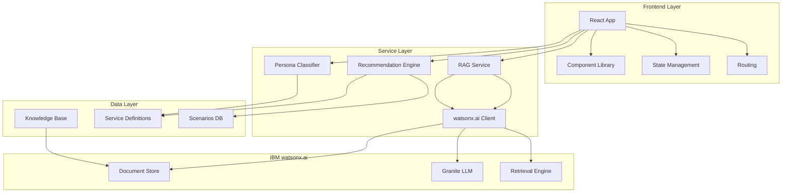
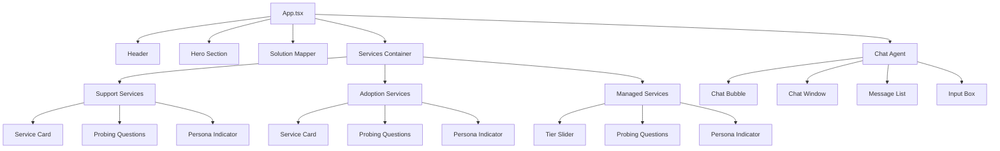
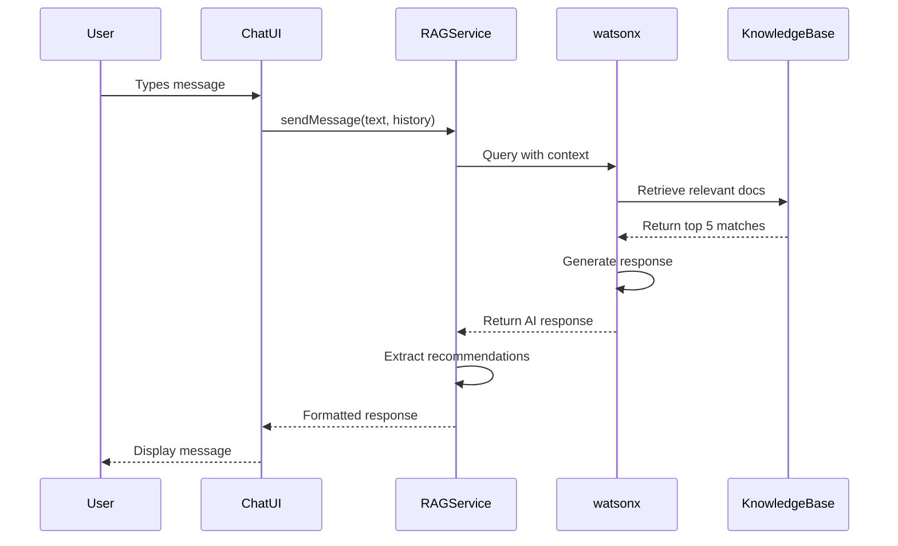
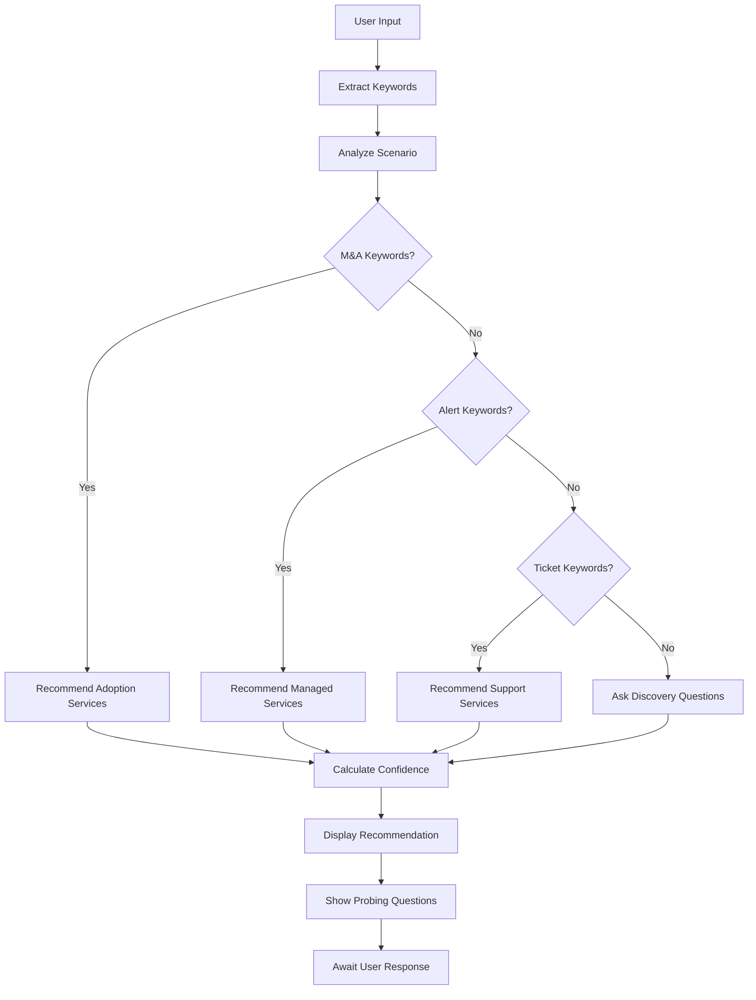

# Arrow Global Services Navigator - Technical Architecture

## System Architecture Diagram



## Component Hierarchy



## Data Flow: RAG Agent Interaction



## Recommendation Engine Flow



## State Management Architecture

```typescript
// Global State Structure
interface AppState {
  user: {
    sessionId: string;
    preferences: UserPreferences;
  };
  chat: {
    messages: Message[];
    isTyping: boolean;
    context: ConversationContext;
  };
  services: {
    selected: ServiceType | null;
    filters: ServiceFilters;
  };
  ui: {
    theme: 'light' | 'dark';
    chatOpen: boolean;
    activeSection: string;
  };
}

// Context Providers
<AppProvider>
  <ThemeProvider>
    <ChatProvider>
      <ServicesProvider>
        <App />
      </ServicesProvider>
    </ChatProvider>
  </ThemeProvider>
</AppProvider>
```

## API Integration Patterns

### watsonx.ai Integration

```typescript
// watsonxClient.ts
class WatsonxClient {
  private apiKey: string;
  private projectId: string;
  private endpoint: string;

  async chat(params: ChatParams): Promise<ChatResponse> {
    const response = await fetch(`${this.endpoint}/v1/chat`, {
      method: 'POST',
      headers: {
        'Authorization': `Bearer ${this.apiKey}`,
        'Content-Type': 'application/json'
      },
      body: JSON.stringify({
        model_id: 'ibm/granite-13b-chat-v2',
        project_id: this.projectId,
        messages: params.messages,
        parameters: {
          temperature: params.temperature || 0.7,
          max_tokens: params.maxTokens || 500,
          top_p: 0.9
        },
        retrieval: {
          collection_id: 'arrow-services',
          top_k: 5,
          min_score: 0.7
        }
      })
    });

    return response.json();
  }

  async ingestDocument(file: File): Promise<IngestResponse> {
    const formData = new FormData();
    formData.append('file', file);
    formData.append('collection_id', 'arrow-services');

    const response = await fetch(`${this.endpoint}/v1/documents`, {
      method: 'POST',
      headers: {
        'Authorization': `Bearer ${this.apiKey}`
      },
      body: formData
    });

    return response.json();
  }
}
```

### Recommendation Engine

```typescript
// recommendationEngine.ts
interface RecommendationResult {
  service: ServiceType;
  tier?: string;
  confidence: number;
  reasoning: string;
  nextQuestions: string[];
}

class RecommendationEngine {
  private scenarios: Scenario[];
  private keywords: KeywordMap;

  analyze(userInput: string, context: ConversationContext): RecommendationResult {
    const tokens = this.tokenize(userInput);
    const keywords = this.extractKeywords(tokens);
    const scenario = this.matchScenario(keywords);
    
    if (scenario) {
      return {
        service: scenario.service,
        tier: scenario.tier,
        confidence: scenario.confidence,
        reasoning: this.generateReasoning(scenario, keywords),
        nextQuestions: this.getProbingQuestions(scenario.service)
      };
    }

    return this.getDefaultRecommendation(context);
  }

  private matchScenario(keywords: string[]): Scenario | null {
    for (const scenario of this.scenarios) {
      const matches = keywords.filter(k => 
        scenario.keywords.includes(k)
      ).length;
      
      if (matches >= scenario.minMatches) {
        return {
          ...scenario,
          confidence: matches / scenario.keywords.length
        };
      }
    }
    return null;
  }

  private generateReasoning(scenario: Scenario, keywords: string[]): string {
    const matchedKeywords = keywords.filter(k => 
      scenario.keywords.includes(k)
    );
    
    return `Based on your mention of ${matchedKeywords.join(', ')}, 
            ${scenario.reasoning}`;
  }
}
```

### Persona Classifier

```typescript
// personaClassifier.ts
interface PersonaResult {
  classification: 'hot' | 'medium' | 'cold';
  score: number;
  factors: string[];
}

class PersonaClassifier {
  classify(answers: Record<string, any>, service: ServiceType): PersonaResult {
    let score = 0;
    const factors: string[] = [];

    switch (service) {
      case 'support':
        if (answers.ticketsPerMonth > 500) {
          score += 3;
          factors.push('High ticket volume (>500/month)');
        } else if (answers.ticketsPerMonth > 100) {
          score += 2;
          factors.push('Medium ticket volume (100-500/month)');
        }

        if (answers.coverage === '24/7') {
          score += 2;
          factors.push('Requires 24/7 coverage');
        }

        if (answers.vendors > 3) {
          score += 2;
          factors.push('Multi-vendor complexity (>3 vendors)');
        }
        break;

      case 'adoption':
        if (answers.maActivity) {
          score += 3;
          factors.push('Active M&A plans');
        }

        if (answers.migrationPlanned) {
          score += 2;
          factors.push('Migration project planned');
        }

        if (answers.skillGaps) {
          score += 2;
          factors.push('Identified skill gaps');
        }
        break;

      case 'managed':
        if (answers.alertOverload) {
          score += 3;
          factors.push('Alert overload reported');
        }

        if (answers.reactivePercentage > 70) {
          score += 2;
          factors.push('Highly reactive (>70%)');
        }

        if (!answers.capacityPlanning) {
          score += 2;
          factors.push('No capacity planning');
        }
        break;
    }

    const classification = score >= 8 ? 'hot' : score >= 5 ? 'medium' : 'cold';

    return { classification, score, factors };
  }
}
```

## Performance Optimization Strategies

### Code Splitting

```typescript
// Lazy load components
const SupportServices = lazy(() => import('./components/SupportServices'));
const AdoptionServices = lazy(() => import('./components/AdoptionServices'));
const ManagedServices = lazy(() => import('./components/ManagedServices'));
const ChatAgent = lazy(() => import('./components/ChatAgent'));

// Route-based splitting
<Suspense fallback={<LoadingSpinner />}>
  <Routes>
    <Route path="/" element={<Hero />} />
    <Route path="/support" element={<SupportServices />} />
    <Route path="/adoption" element={<AdoptionServices />} />
    <Route path="/managed" element={<ManagedServices />} />
  </Routes>
</Suspense>
```

### Caching Strategy

```typescript
// React Query configuration
const queryClient = new QueryClient({
  defaultOptions: {
    queries: {
      staleTime: 5 * 60 * 1000, // 5 minutes
      cacheTime: 10 * 60 * 1000, // 10 minutes
      refetchOnWindowFocus: false,
      retry: 2
    }
  }
});

// Cache RAG responses
const useChatQuery = (message: string) => {
  return useQuery({
    queryKey: ['chat', message],
    queryFn: () => ragService.sendMessage(message),
    staleTime: Infinity, // Cache indefinitely
    enabled: !!message
  });
};
```

### Image Optimization

```typescript
// Use WebP with fallback
<picture>
  <source srcSet="/arrow-logo.webp" type="image/webp" />
  <source srcSet="/arrow-logo.png" type="image/png" />
  
</picture>

// Lazy load images

```

## Security Implementation

### API Key Management

```typescript
// Environment variables (never commit)
VITE_WATSONX_API_KEY=your_api_key_here
VITE_WATSONX_PROJECT_ID=your_project_id
VITE_WATSONX_ENDPOINT=https://api.watsonx.ai

// Secure client-side handling
class SecureClient {
  private apiKey: string;

  constructor() {
    // API key should be fetched from backend, not exposed in frontend
    this.apiKey = import.meta.env.VITE_WATSONX_API_KEY;
    
    if (!this.apiKey) {
      throw new Error('API key not configured');
    }
  }

  // Use proxy endpoint to hide API key
  async makeRequest(endpoint: string, data: any) {
    return fetch(`/api/proxy${endpoint}`, {
      method: 'POST',
      headers: { 'Content-Type': 'application/json' },
      body: JSON.stringify(data)
    });
  }
}
```

### Rate Limiting

```typescript
// Client-side rate limiter
class RateLimiter {
  private requests: number[] = [];
  private limit: number = 100; // requests per hour
  private window: number = 60 * 60 * 1000; // 1 hour

  canMakeRequest(): boolean {
    const now = Date.now();
    this.requests = this.requests.filter(time => now - time < this.window);
    
    if (this.requests.length >= this.limit) {
      return false;
    }

    this.requests.push(now);
    return true;
  }

  getTimeUntilReset(): number {
    if (this.requests.length === 0) return 0;
    const oldest = this.requests[0];
    return Math.max(0, this.window - (Date.now() - oldest));
  }
}
```

### Input Sanitization

```typescript
// Sanitize user input before sending to RAG
function sanitizeInput(input: string): string {
  return input
    .trim()
    .replace(/<script[^>]*>.*?<\/script>/gi, '')
    .replace(/<[^>]+>/g, '')
    .substring(0, 1000); // Max length
}

// Validate email
function validateEmail(email: string): boolean {
  const regex = /^[^\s@]+@[^\s@]+\.[^\s@]+$/;
  return regex.test(email);
}
```

## Monitoring & Analytics

### Performance Monitoring

```typescript
// Web Vitals tracking
import { getCLS, getFID, getFCP, getLCP, getTTFB } from 'web-vitals';

function sendToAnalytics(metric: Metric) {
  const body = JSON.stringify(metric);
  
  if (navigator.sendBeacon) {
    navigator.sendBeacon('/analytics', body);
  } else {
    fetch('/analytics', { method: 'POST', body, keepalive: true });
  }
}

getCLS(sendToAnalytics);
getFID(sendToAnalytics);
getFCP(sendToAnalytics);
getLCP(sendToAnalytics);
getTTFB(sendToAnalytics);
```

### User Analytics

```typescript
// Track user interactions
interface AnalyticsEvent {
  category: string;
  action: string;
  label?: string;
  value?: number;
}

class Analytics {
  track(event: AnalyticsEvent) {
    // Send to analytics service
    fetch('/api/analytics', {
      method: 'POST',
      headers: { 'Content-Type': 'application/json' },
      body: JSON.stringify({
        ...event,
        timestamp: Date.now(),
        sessionId: this.getSessionId()
      })
    });
  }

  trackPageView(path: string) {
    this.track({
      category: 'Navigation',
      action: 'Page View',
      label: path
    });
  }

  trackChatInteraction(messageType: string) {
    this.track({
      category: 'Chat',
      action: 'Message Sent',
      label: messageType
    });
  }

  trackServiceView(service: string) {
    this.track({
      category: 'Services',
      action: 'View',
      label: service
    });
  }

  trackCTAClick(location: string) {
    this.track({
      category: 'Conversion',
      action: 'CTA Click',
      label: location
    });
  }
}
```

## Error Handling

### Global Error Boundary

```typescript
class ErrorBoundary extends React.Component<Props, State> {
  state = { hasError: false, error: null };

  static getDerivedStateFromError(error: Error) {
    return { hasError: true, error };
  }

  componentDidCatch(error: Error, errorInfo: ErrorInfo) {
    console.error('Error caught by boundary:', error, errorInfo);
    
    // Send to error tracking service
    fetch('/api/errors', {
      method: 'POST',
      headers: { 'Content-Type': 'application/json' },
      body: JSON.stringify({
        error: error.toString(),
        stack: error.stack,
        componentStack: errorInfo.componentStack
      })
    });
  }

  render() {
    if (this.state.hasError) {
      return (
        <div className="error-container">
          <h1>Something went wrong</h1>
          <p>We're sorry for the inconvenience. Please refresh the page.</p>
          <button onClick={() => window.location.reload()}>
            Refresh Page
          </button>
        </div>
      );
    }

    return this.props.children;
  }
}
```

### API Error Handling

```typescript
async function handleApiCall<T>(
  apiCall: () => Promise<T>,
  fallback?: T
): Promise<T> {
  try {
    return await apiCall();
  } catch (error) {
    if (error instanceof NetworkError) {
      toast.error('Network error. Please check your connection.');
    } else if (error instanceof AuthError) {
      toast.error('Authentication failed. Please try again.');
    } else if (error instanceof RateLimitError) {
      toast.error('Too many requests. Please wait a moment.');
    } else {
      toast.error('An unexpected error occurred.');
    }

    if (fallback !== undefined) {
      return fallback;
    }

    throw error;
  }
}
```

## Testing Architecture

### Unit Test Structure

```typescript
// Component test example
describe('ChatAgent', () => {
  it('should render chat bubble', () => {
    render(<ChatAgent />);
    expect(screen.getByTestId('chat-bubble')).toBeInTheDocument();
  });

  it('should open chat window on bubble click', async () => {
    render(<ChatAgent />);
    const bubble = screen.getByTestId('chat-bubble');
    
    await userEvent.click(bubble);
    
    expect(screen.getByTestId('chat-window')).toBeVisible();
  });

  it('should send message and receive response', async () => {
    const mockResponse = { message: 'Test response' };
    vi.spyOn(ragService, 'sendMessage').mockResolvedValue(mockResponse);
    
    render(<ChatAgent />);
    await userEvent.click(screen.getByTestId('chat-bubble'));
    
    const input = screen.getByTestId('chat-input');
    await userEvent.type(input, 'Test message');
    await userEvent.click(screen.getByTestId('send-button'));
    
    await waitFor(() => {
      expect(screen.getByText('Test response')).toBeInTheDocument();
    });
  });
});
```

### Integration Test Example

```typescript
// RAG service integration test
describe('RAG Service Integration', () => {
  it('should retrieve relevant documents and generate response', async () => {
    const message = 'We are merging with another company';
    const response = await ragService.sendMessage(message);
    
    expect(response).toHaveProperty('message');
    expect(response).toHaveProperty('recommendations');
    expect(response.recommendations).toContain('M&A Integration');
  });

  it('should handle rate limiting gracefully', async () => {
    // Make 101 requests (over limit)
    const requests = Array(101).fill(null).map(() => 
      ragService.sendMessage('test')
    );
    
    await expect(Promise.all(requests)).rejects.toThrow(RateLimitError);
  });
});
```

## Deployment Configuration

### Docker Configuration

```dockerfile
# Dockerfile
FROM node:18-alpine AS builder

WORKDIR /app
COPY package*.json ./
RUN npm ci

COPY . .
RUN npm run build

FROM nginx:alpine
COPY --from=builder /app/dist /usr/share/nginx/html
COPY nginx.conf /etc/nginx/nginx.conf

EXPOSE 80
CMD ["nginx", "-g", "daemon off;"]
```

### Kubernetes Deployment

```yaml
# deployment.yaml
apiVersion: apps/v1
kind: Deployment
metadata:
  name: arrow-services-navigator
spec:
  replicas: 3
  selector:
    matchLabels:
      app: arrow-navigator
  template:
    metadata:
      labels:
        app: arrow-navigator
    spec:
      containers:
      - name: app
        image: arrow-navigator:latest
        ports:
        - containerPort: 80
        env:
        - name: WATSONX_API_KEY
          valueFrom:
            secretKeyRef:
              name: watsonx-credentials
              key: api-key
        resources:
          requests:
            memory: "256Mi"
            cpu: "250m"
          limits:
            memory: "512Mi"
            cpu: "500m"
---
apiVersion: v1
kind: Service
metadata:
  name: arrow-navigator-service
spec:
  selector:
    app: arrow-navigator
  ports:
  - protocol: TCP
    port: 80
    targetPort: 80
  type: LoadBalancer
```

## Accessibility Considerations

### WCAG 2.1 AA Compliance

```typescript
// Keyboard navigation
useEffect(() => {
  const handleKeyPress = (e: KeyboardEvent) => {
    if (e.key === 'Escape' && chatOpen) {
      setChatOpen(false);
    }
    if (e.key === '/' && !chatOpen) {
      e.preventDefault();
      setChatOpen(true);
    }
  };

  window.addEventListener('keydown', handleKeyPress);
  return () => window.removeEventListener('keydown', handleKeyPress);
}, [chatOpen]);

// ARIA labels
<button
  aria-label="Open chat assistant"
  aria-expanded={chatOpen}
  aria-controls="chat-window"
  onClick={() => setChatOpen(true)}
>
  <ChatIcon />
</button>

// Focus management
useEffect(() => {
  if (chatOpen) {
    inputRef.current?.focus();
  }
}, [chatOpen]);

// Color contrast
// Ensure all text meets WCAG AA standards (4.5:1 for normal text)
const colors = {
  primary: '#FF671F', // Orange
  primaryText: '#FFFFFF', // White (contrast ratio: 4.52:1) ✓
  secondary: '#475569', // Slate
  secondaryText: '#FFFFFF', // White (contrast ratio: 8.59:1) ✓
};
```

This technical architecture provides a comprehensive foundation for building the Arrow Global Services Navigator with enterprise-grade quality, security, and performance.